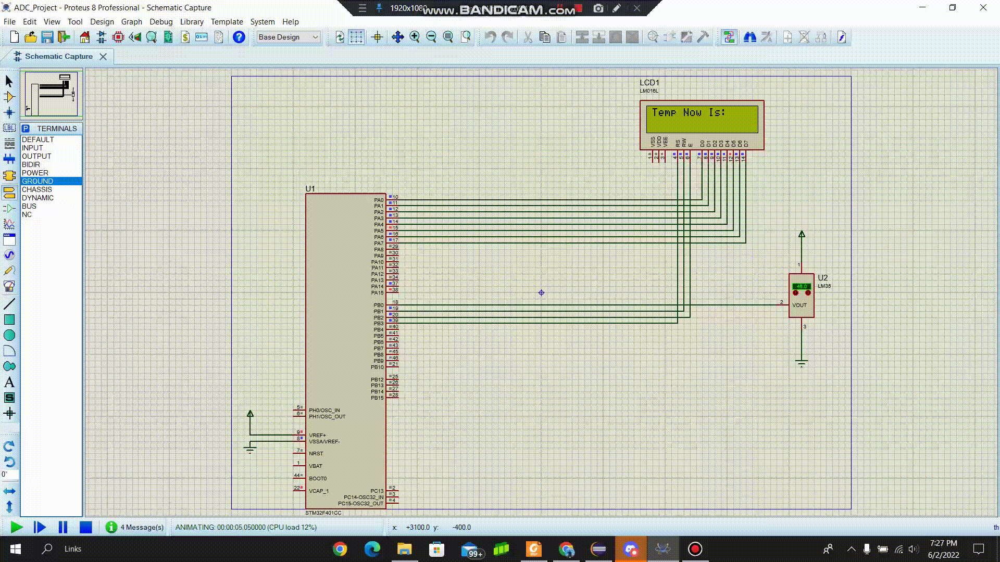

# Temperature-Displayer
# Sampling-Reconstruction-Signals

- [Temperature-Displayer](#temperature-displayer)
- [Sampling-Reconstruction-Signals](#sampling-reconstruction-signals)
  - [Features](#features)
  - [Demos](#demos)
    - [Display Temperature Demo](#display-temperature-demo)

## Features
- Implementing a complete ADC driver for the STM32 MCU
- The Driver has the following services:
  - The configuration parameters:
     - Resolution (enum type)
     - Conversion mode (single or continues) - (enum type)
  - Starting a software conversion in the single or continuous conversion mode.
  - Controlling the conversion state by using macro USE_POLLING is 1 or 0
  - An ISR to notify that a conversion is completed
  - Using LM35 as an interface (temperature sensor).
The sensor temperature can be continuously monitored and displayed on LM016 character LCD

## Demos

### Display Temperature Demo 
